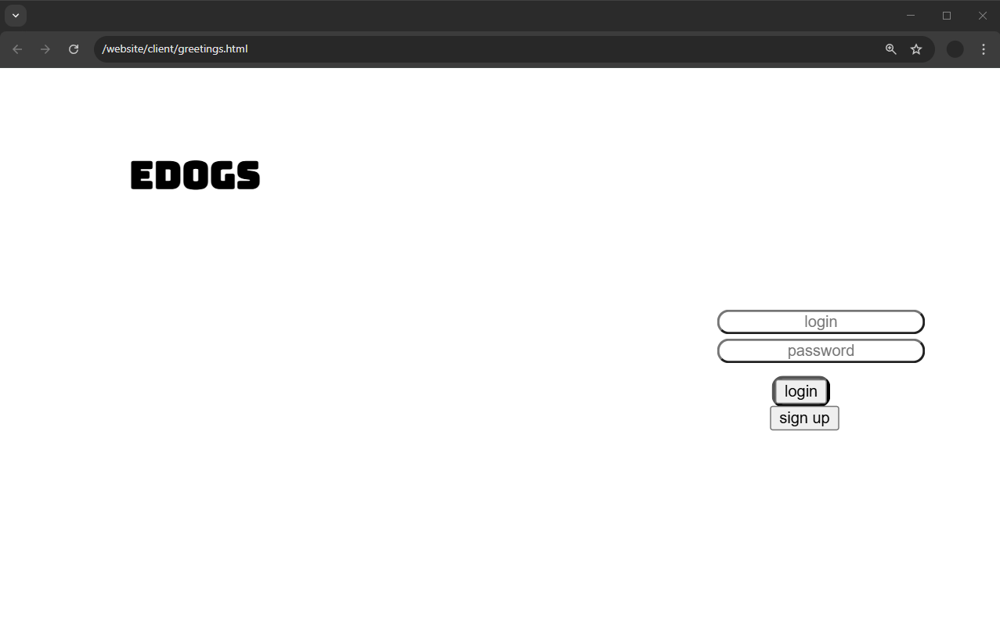
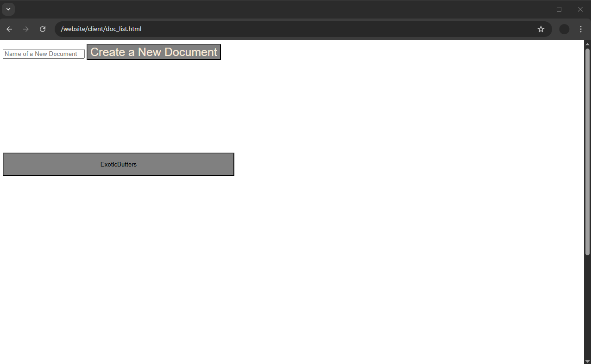
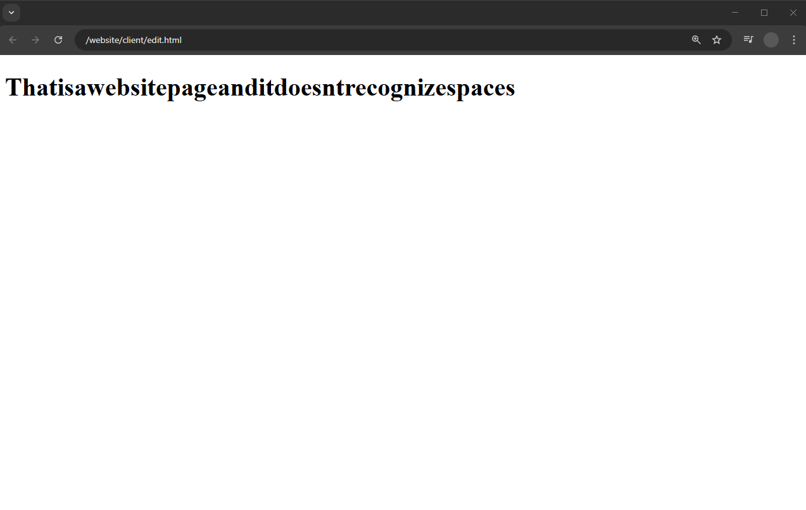

EDOGS document editor

---
Components:
- Website - html/css, js, Socket.io
- API - Userver, postgresql, websockets
---

### Website

Three pages:
1. greetings
	

2. doc_list
	

3. edit
	

### API

Two websocket handlers:
1. websocket-edit
	path: /char
	method: GET
	Puts values into json file. (login, DocsName, text) and then inserts it into EDOGS.docs or updates the line
2. websocket-entry
	path: /entry
	method: GET
	Stores the login, password, entry_type (login or register) into a json file.
